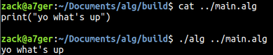

# alg

This is mostly for me to practice C++. Nothing more. Not intended for any other purpose!

Only tested in Ubuntu 18.04

## Quick Start

- download or clone repo. 
- `mkdir build && cd build`
- `sudo snap install cmake`
- `cmake ../`
- `make`
- `./alg ../example.alg`

alg will interpret your source file "example.alg" and execute it's code.

example:

## Available Functions for alg files:

#### void print("string literal goes here");
  
prints string literal to stdout
